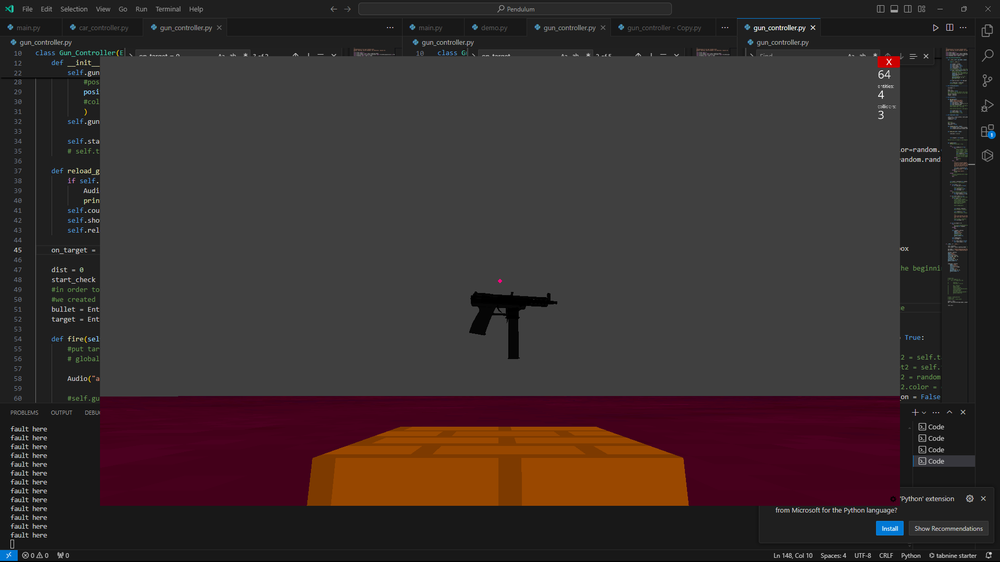
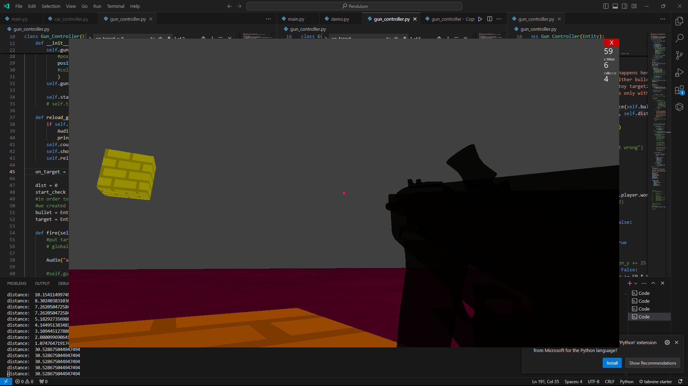
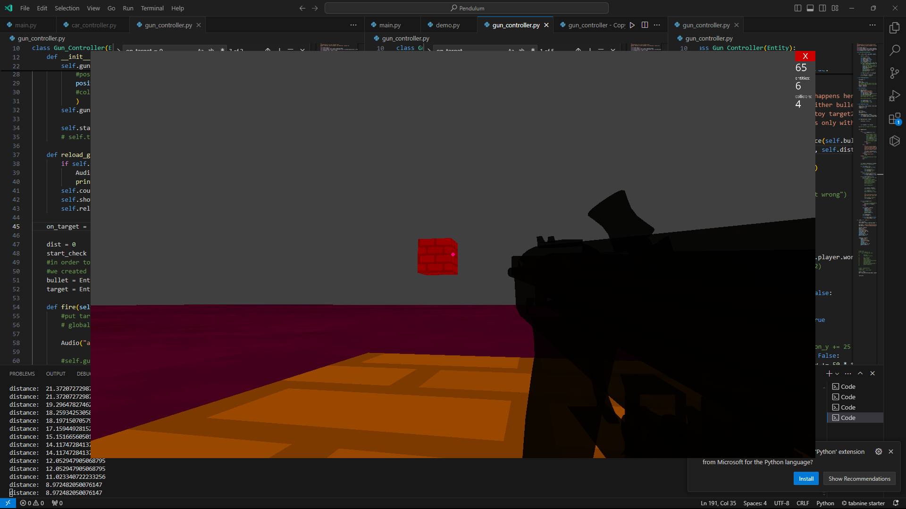
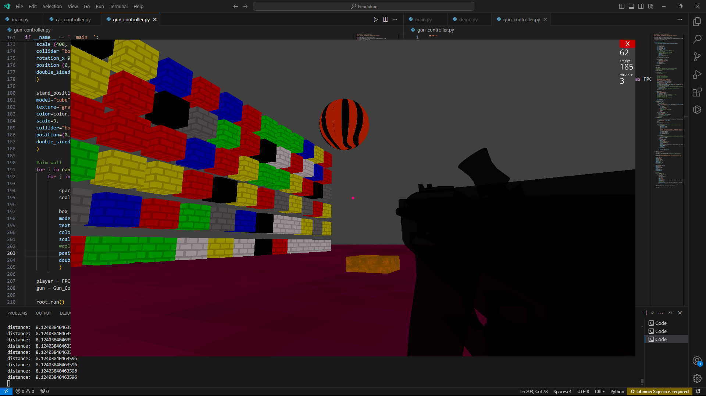
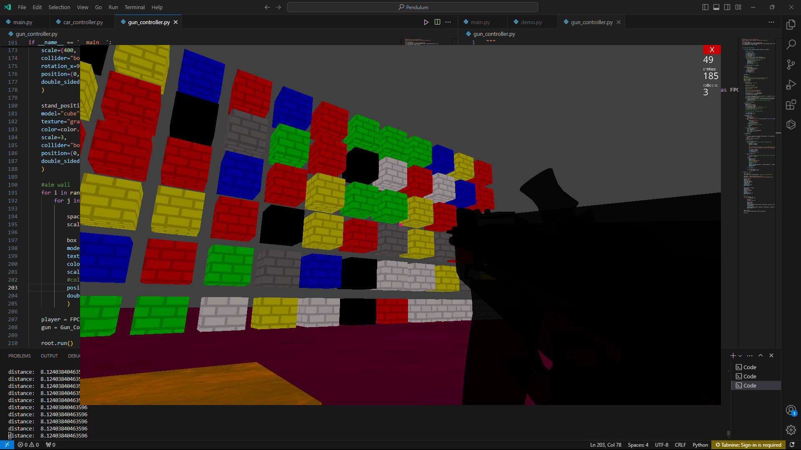

### Ursina Gun_Controller for FirstPersonController

As we know, the current version of the Ursina Engine (<= 7.0..0) lacks built-in gun controllers or car controllers. To bridge this gap, Ukacha21/Ursina-G_Controller steps in!  This meticulously designed gun controller is specifically tailored for Ursina's FirstPersonController. This innovative package empowers you to seamlessly integrate robust gun mechanics into your projects, elevating the gameplay and user engagement to new heights.

**Objects**

* Gun
* Stand Position
* Ground
* (superpositioned) target

**Benefits**

* **Effortless Integration**: Designed with developer ease-of-use in mind, Ursina-G_Controller seamlessly integrates with Ursina's existing FirstPersonController, streamlining the development process.

* **Fine-Tuned Control**: Experience unparalleled precision with a comprehensive set of features, allowing you to craft a truly realistic and engaging gunplay experience.

* **Open-Source Power**: Leverage the power of open-source development! Ursina-G_Controller provides complete access and customization capabilities, perfect for tailoring it to your specific project needs.

**Requirements**

* Python (optional: V 3.12.3)
* Ursina Engine Version 7.0.0 or higher:

      pip install ursina

* threading (built-in)
* delta time (come with ursina)
* random (built-in or with ursina)

**Installation**

To install you can follow these steps:

1. Clone the repository
2. Run `main.py`

`` **note**: gun_controller.py is just a module, the other copies contain other types of target objects ``

**Examples:**

**Contributing**

We welcome contributions. If you have any bug fixes, improvements, or new features, you can submit a pull request.

**License**

Ursina G_Controller © 2024 by Ukacha Juma is licensed under CC BY-NC 4.0 
